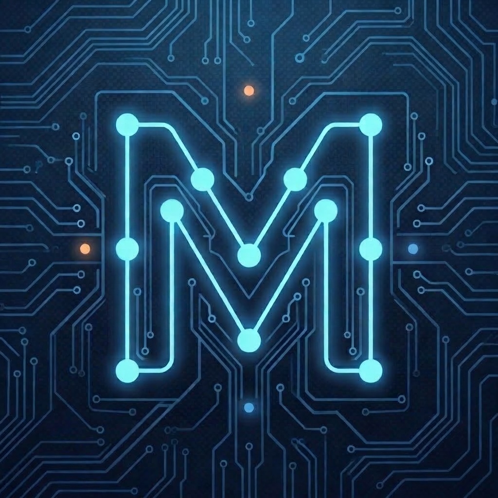
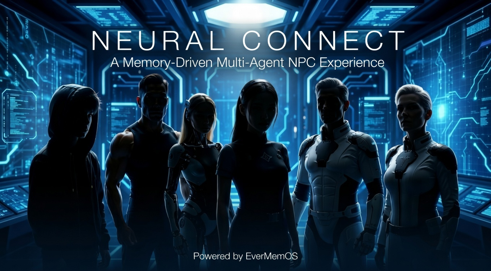

  

<h1 align="center">NeuralConnect</h1>

  
  
  

  An iOS narrative mystery set aboard a Mars-bound cyberpunk shuttle.

---

You explore the ship, listen in on NPC conversations, and use **Neural Connect** to dive into what characters remember — then connect the clues to uncover the truth.

## What players do

NeuralConnect is built around a simple loop:

- **Explore** a 2D shuttle map (tap to move).
- **Listen** when multiple NPCs are nearby.
- **Connect** to a single NPC to review their memory trail.
- **Investigate** with a visual clue board that grows as you learn more.

The ship is divided into six zones: `Gym`, `Medbay`, `Lab`, `Power Room`, `Bar`, `Casino`.

## Key features

- **AI-driven dialogue** between NPCs (with fallback when AI is unavailable)
- **Persistent character memory** so NPCs can build context over time
- **Clue board / knowledge graph** that helps you spot relationships and recurring topics
- **English / 中文** support

## Emergent NPC dialogue samples

Full simulation logs — 30 AI-generated conversations where NPCs build memories, form relationships, and reveal secrets over time:

- [English](docs/simulation_log_v3.md) | [中文](docs/simulation_log_v3.zh.md)

## Modes & settings (in-app)

From the gear icon you can:

- Switch **Language** (English / 中文)
- Choose the **AI dialogue engine** (optional)
- Configure the **memory backend** (optional)
- **Delete all NPC memories** (for a clean playthrough / testing)
- Replay the intro story sequence

## Getting started (dev)

### Requirements

- Xcode 26+
- iOS 26+ (Simulator or device)
- EverMemOS backend (required to start gameplay)
  - Cloud: base URL + token
  - Local: base URL (no token)
- AI dialogue provider (optional)
  - DeepSeek API key (recommended), or
  - Apple Intelligence on-device (when available on iOS 26+)

### Run

1. Open `NeuralConnect.xcodeproj`
2. Select a destination
3. Build & Run

### First-run setup (in-app)

The game won’t start until EverMemOS is configured:

1. Open **Settings** (gear icon)
2. Configure **EverMemOS**
   - **Cloud**: enter Base URL + Token
   - **Local**: enter Base URL (tip: on iPhone, don’t use `localhost` — use a reachable LAN IP)
3. (Optional) Configure **AI Dialogue Engine**
   - Enable DeepSeek and enter an API key, or rely on Apple Intelligence if available on your device

## Privacy / data

NeuralConnect can be run in a “local-only / offline” style depending on what you enable in Settings.

If you opt in to external services, the app may send:
- NPC memory summaries/metadata to the configured memory backend
- Dialogue generation requests to the configured AI provider

Nothing is sent until you enter credentials/URLs in Settings.

Full privacy policy: [docs/privacy-policy.md](docs/privacy-policy.md)

## Disclaimer

NeuralConnect is a creative/research prototype and is not intended for safety-critical use.

## License

No license file is provided in this repository. By default, all rights are reserved by the copyright holder.
